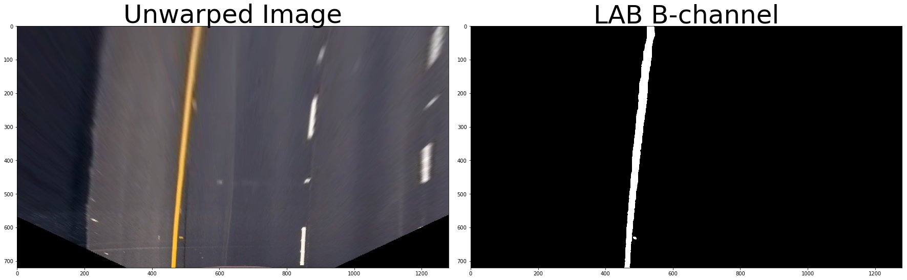

# Advanced Lane Finding Project

The goals / steps of this project are the following:

* Compute the camera calibration matrix and distortion coefficients given a set of chessboard images.
* Apply a distortion correction to raw images.
* Use color transforms, gradients, etc., to create a thresholded binary image.
* Apply a perspective transform to rectify binary image ("birds-eye view").
* Detect lane pixels and fit to find the lane boundary.
* Determine the curvature of the lane and vehicle position with respect to center.
* Warp the detected lane boundaries back onto the original image.
* Output visual display of the lane boundaries and numerical estimation of lane curvature and vehicle position.

## Camera Calibration

### 1. Briefly state how you computed the camera matrix and distortion coefficients. Provide an example of a distortion corrected calibration image.

The code for this step is contained in the first code cell of the IPython notebook located in `advanced_lane_finding.ipynb` (code cells #2-3).

I start by preparing "object points", which will be the (x, y, z) coordinates of the chessboard corners in the world. Here I am assuming the chessboard is fixed on the (x, y) plane at z=0, such that the object points are the same for each calibration image.  Thus, `objp` is just a replicated array of coordinates, and `objpoints` will be appended with a copy of it every time I successfully detect all chessboard corners in a test image.  `imgpoints` will be appended with the (x, y) pixel position of each of the corners in the image plane with each successful chessboard detection. 


Unfortunatly, the `findChessboardCorners()` failed to find desired corners on three images out of 20 provided calibration images, because there were not enought corners on these images due to framing. These frames were not used for distortion measuring.


## Pipeline

### 1. Provide an example of a distortion-corrected image.

To demonstrate this step, I will describe how I apply the distortion correction to one of the test images like this one (code cells #8-9 of `advanced_lane_finding.ipynb` ):


Undistort the image using `cv2.undistort()` with mtx and dist.

### 2. Describe how (and identify where in your code) you used color transforms, gradients or other methods to create a thresholded binary image.  Provide an example of a binary image result.

#### Visualize multiple colorspace channels

- RGB
    - RGB R-Channel
    - RGB G-Channel
    - RGB B-Channel
- HSV
    - HSV H-Channel (Hue)
    - HSV S-Channel (Saturation)
    - HSV V-Channel (Value; similar to lightness)
- LAB
    - LAB L-Channel (Luminance)
    - LAB A-Channel (green–red)
    - LAB B-Channel (blue–yellow)

The result images are below (code cell #12 of `advanced_lane_finding.ipynb`):


#### Color Selection

In order to pick the right lower bound and upper bound value for each color space, I create a GUI that allows me to play with the value and see how it affects final result: 

##### HLS L-Channel

- code cells #22-23 of `advanced_lane_finding.ipynb`


##### LAB B-Channel

- code cells #24-25 of `advanced_lane_finding.ipynb`




#### Combine Color Method

- code cells #26 of `advanced_lane_finding.ipynb`

| Channel Threshold | HLS L-Channel | LAB B-Channel |
| :---------------: | :-----------: | :-----------: |
|   `min_thresh`    |      220      |      190      |
|   `max_thresh`    |      255      |      255      |

The result images combined the color methods are below(code cells #27 of `advanced_lane_finding.ipynb`):


### 3. Describe how (and identify where in your code) you performed a perspective transform and provide an example of a transformed image.

### Perspective Transform

- Use `cv2.getPerspectiveTransform()` to get `M`, the transform matrix
- Use `cv2.warpPerspective()` to apply `M` and warp your image to a top-down view

The code for my perspective transform includes a function called `unwarp()`, which appears in code cell #11 of `advanced_lane_finding.ipynb`.

The `unwarp()` function takes as inputs an image (`img`), as well as source (`src`) and destination (`dst`) points.  I chose the hardcode the source and destination points in the following manner:

```python
offset = 450

src = np.float32(
    [(575,464),
     (707,464),
     (258,682), 
     (1049,682)]
    
dst = np.float32(
    [(offset,0),
     (img_size[0]-offset,0),
     (offset,img_size[-1]),
     (img_size[0]-offset,img_size[-1])])
```

This resulted in the following source and destination points:

|  Source   | Destination |
| :-------: | :---------: |
| 575, 464  |   450, 0    |
| 707, 464  |   830, 0    |
| 258, 682  |  450, 720   |
| 1049, 682 |  830, 720   |

I verified that my perspective transform was working as expected by drawing the `src` and `dst` points onto a test image and its warped counterpart to verify that the lines appear parallel in the warped image.


### 4. Describe how (and identify where in your code) you identified lane-line pixels and fit their positions with a polynomial?

#### Sliding Window Search

The code for searching lane pixels includes a function called `sliding_window_polyfit()`, which appears in code cell #28 of `advanced_lane_finding.ipynb`. 

The `sliding_window_polyfit()` function takes as inputs an image (`img`). 

- Divide an image basically into N windows and for each window.

- Calculate the histogram and use two prominent peaks as the left and right lane. 

The image to visualize the result on an example test image is below(code cell #29 of `advanced_lane_finding.ipynb`):


The histogram figure for the data visualization is below.


#### Polyfit Using Fit from Previous Frame

The code for searching lane pixels includes a function called `polyfit_using_prev_fit()`, which appears in code cell #31 of `advanced_lane_finding.ipynb`. 

The `polyfit_using_prev_fit()` function takes as inputs an image (`binary_warped`), as well as previous left fit (`left_fit_prev`) and previous right fit (`right_fit_prev`) points.

This function operates the same thing with `sliding_window_polyfit()` function, but reduces much difficulty of the search process by using a previous fit and only searching for lane pixels within a certain range of that fit. 

The image below shows this: the green shaded area is the range from the previous fit area, and the yellow line and red pixels are from the current image(code cell #32 of `advanced_lane_finding.ipynb`. ).


### 5. Describe how (and identify where in your code) you calculated the radius of curvature of the lane and the position of the vehicle with respect to center.

The code for calculating the radius of curvature of the lane and the lane center position includes a function called `calc_curv_rad_and_center_dist()`, which appears in code cell #33 of `advanced_lane_finding.ipynb`. 

The `polyfit_using_prev_fit()` function takes as inputs an image (`bin_img`), as well as polynomial left fit (`l_fit`), polynomial right fit (`r_fit`) points, L & R lane pixel indices (`l_lane_inds`, `r_lane_inds`).

#### Curvature

Here’s a very useful tutorial about [curvature calculation](https://www.intmath.com/applications-differentiation/8-radius-curvature.php). I use the following formula to calculate the curvature:

In case of a second order polynomial curve, the derivatives are:

Thus, the equation of curvature is:

I take the average of left and right lane curvature to calculate the curvature for the lane.

```python
left_curverad = ((1 + (2*left_fit_cr[0]*y_eval*ym_per_pix + left_fit_cr[1])**2)**1.5) / np.absolute(2*left_fit_cr[0])

right_curverad = ((1 + (2*right_fit_cr[0]*y_eval*ym_per_pix + right_fit_cr[1])**2)**1.5) / np.absolute(2*right_fit_cr[0])
```

#### Lane Center
```python
lane_center_position = (r_fit_x_int + l_fit_x_int) /2
```
```python
center_dist = (car_position - lane_center_position) * xm_per_pix
```


### 6. Provide an example image of your result plotted back down onto the road such that the lane area is identified clearly.

#### Draw the Lins onto the image

The code for drawing the lines onto the image includes a function called `draw_lane()`, which appears in code cell #35 of `advanced_lane_finding.ipynb`. 

As in the previous example, I have a warped binary image called `binary_img`, and I have fit the lines with a polynomial and have arrays called `ploty`, `l_fit` and `r_fit`, which represent the x and y pixel values of the lines.


#### Annotate the image

The code for the data annotation onto the image includes a function called `draw_data()`, which appears in code cell #37 of `advanced_lane_finding.ipynb`. 

The results of the `draw_data()` , which annotates text identifying the curvature radius and vehicle position data onto the original image:


---

## Video

#### 1. Provide a link to your final video output.  Your pipeline should perform reasonably well on the entire project video (wobbly lines are ok but no catastrophic failures that would cause the car to drive off the road!).

Here's a [link to my video result](https://github.com/jeongwhanchoi/CarND-Advanced-Lane-Lines/blob/master/project_video_output.mp4)

---

## Discussion

#### 1. Briefly discuss any problems / issues you faced in your implementation of this project.  Where will your pipeline likely fail?  What could you do to make it more robust?

Using this pipeline, I can get a perfect result for video. What’s more, it can reuse previous result in case that lane pixels can’t be found! If you check “lane_on_original_image.png”, you can see that the sliding window method returns zero pixels and the algorithm can still be able to generate output.


However, I am still not able to generate satisfying output for the challenge video and the harder-challenge video.


I am still experimenting with some improvements: 

1. More experiments with gradient selections like the gradient magnitude or gradient direction
2. Restrict the search margin to lower value
3. Deep neural networks should be applied in the case of line absence in order to predict and determinate where the lane position should be.

##### Future Works

I need to generate the satisfying output for the two challenge videos below.

- challenge_video.mp4
- harder_challenge_video.mp4